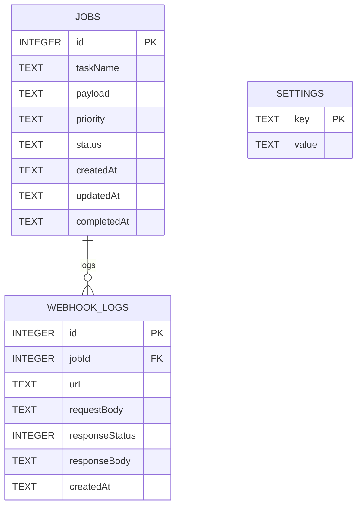

# Dotix Job Scheduler

Repository structure

- `/frontend` — Next.js + Tailwind UI (dev: port 3000)
- `/backend` — Express API server (dev: port 4000)

---

## Persistence & restarts — will my DB be wiped?

Short answer:

- On your local machine (running the server from the workspace), the SQLite file `jobs.db` is created in the server directory by default and will persist across server restarts.
- In cloud/container environments (including Render) the filesystem is often ephemeral by default; restarting or redeploying the service can replace the container and wipe any files not stored on a persistent disk or external database.

Details & guidance:

- Local development: by default the server uses `server/jobs.db` (unless you set `DB_PATH`). Restarting the Node process (or the machine) does not delete that file.

- Containers / PaaS (ephemeral FS): platforms like Render spin up new containers on deploy or restart. Any files written to the container's filesystem are typically ephemeral and can be lost on redeploy. To avoid data loss on these platforms you must either:
	- Attach a persistent disk and point the server at a DB path on that disk (e.g. mount disk at `/data` and use `/data/jobs.db`), or
	- Switch to a managed relational DB (Postgres) and change the server to use it instead of SQLite.

- Configuration: the server supports `DB_PATH` environment variable. To change the DB location set `DB_PATH` in your environment or in Render's Environment settings. Example:

```bash
# run locally with custom DB location
DB_PATH=/data/jobs.db PORT=4000 node server/index.js
```

- Backups and migration:
	- Backup SQLite DB:

```bash
sqlite3 server/jobs.db ".backup backup_jobs.db"
```

	- Dump SQL for migration/import:

```bash
sqlite3 server/jobs.db .dump > jobs_dump.sql
```

	- Restore/import:

```bash
sqlite3 server/jobs.db < jobs_dump.sql
```

Recommended production approach:

1. For any production workload prefer a managed DB (Postgres, MySQL) so you have backups, multi-AZ, and proper scaling.
2. If you must use SQLite in a hosted environment, attach a persistent disk and set `DB_PATH` to the mounted path (e.g. `/data/jobs.db`).
3. Add automated backups (periodic dump or copy) and monitor disk usage.

If you want, I can now:

- update `frontend/pages/api/proxy/[...path].js` to use `BACKEND_URL` env var and commit that change, or
- ensure `server/index.js` uses `DB_PATH` everywhere (already set) and add a small startup check to create parent directory for `DB_PATH`, or
- add a tiny migration script and backup commands in a `scripts/` folder.

Tell me which you'd like me to implement and I'll apply it.

## 1) Setup Instructions

Prerequisites

- Node.js (v18+ recommended)
- npm

Start the backend (server):

```bash
cd server
npm install
# Optional: set WEBHOOK_URL for quick webhook testing
# export WEBHOOK_URL="https://webhook.site/<your-id>"
npm start
```

Start the frontend (dashboard):

```bash
cd frontend
npm install
npm run dev
```

- Backend default: `http://localhost:4000`
- Frontend default: `http://localhost:3000`

Quick curl smoke tests

```bash
curl http://127.0.0.1:4000/
curl -X POST http://127.0.0.1:4000/jobs -H "Content-Type: application/json" -d '{"taskName":"Send Email","payload":{"to":"x@x.com"},"priority":"High"}'
curl http://127.0.0.1:4000/jobs
```

---

## 2) Tech stack

- Backend: Node.js + Express
- DB: SQLite (`sqlite3` package)
- Frontend: Next.js (React) + Tailwind CSS
- Data fetching: SWR

---

## 3) Schema / ER design

Tables (SQLite):

- `jobs`
	- `id` INTEGER PRIMARY KEY AUTOINCREMENT
	- `taskName` TEXT NOT NULL
	- `payload` TEXT (JSON string)
	- `priority` TEXT
	- `status` TEXT
	- `createdAt` TEXT
	- `updatedAt` TEXT
	- `completedAt` TEXT

- `webhook_logs`
	- `id` INTEGER PRIMARY KEY AUTOINCREMENT
	- `jobId` INTEGER
	- `url` TEXT
	- `requestBody` TEXT
	- `responseStatus` INTEGER
	- `responseBody` TEXT
	- `createdAt` TEXT

- `settings`
	- `key` TEXT PRIMARY KEY
	- `value` TEXT

Mermaid ER diagram (GitHub supports Mermaid):



ASCII ER (simplified):

```
jobs (1) <---- (N) webhook_logs
jobs.id -> webhook_logs.jobId
```

---

## 4) Architecture

- `frontend` (Next.js) provides the UI and a proxy API `pages/api/proxy/[...path].js`.
- Proxy forwards requests to the backend (avoids CORS and centralizes API calls).
- `server` (Express) manages job lifecycle and SQLite storage. `run-job/:id` simulates processing (setTimeout) then sends webhook POSTs.
- Webhook URL is persisted in `settings` (key: `webhook_url`) or can be provided via `WEBHOOK_URL` env var.

Production notes: replace the `setTimeout` simulation with a real worker/queue and add authentication and error monitoring.

---

## 5) API documentation

Base: `http://localhost:4000`

- GET `/` — API info

- POST `/jobs`
	- Body: `{ taskName: string, payload: object, priority?: string }`
	- Response: created job object

- GET `/jobs`
	- Query params: optional `status`, `priority`
	- Response: jobs list (latest first)

- GET `/jobs/:id` — job detail

- POST `/run-job/:id` — start job processing

- POST `/webhook-test` — a simple endpoint to receive/test webhooks on the server (returns received body)

- GET `/webhook-logs` — returns webhook delivery attempts

- POST `/settings/webhook` — body `{ url: string }` — save webhook URL
- GET `/settings/webhook` — get saved webhook URL

Frontend proxy

- The frontend exposes `/api/proxy/*` endpoints that forward to the backend; use those from browser code to avoid CORS issues.

---

## 6) How webhooks work

1. Save a webhook URL from the UI (Webhook Settings) or call `POST /settings/webhook`.
2. When a job completes, the server reads the saved webhook URL and POSTs a JSON payload including jobId, taskName, payload and completedAt.
3. The server stores the response status/body in `webhook_logs` for auditing.

Payload example

```json
{
	"jobId": 123,
	"taskName": "Send Email",
	"priority": "High",
	"payload": {...},
	"completedAt": "2026-01-11T..."
}
```
```json
{
    "taskName": "Send Email Notification",
    "payload": {
        "email": "abc@gmail.com",
        "subject": "Hello"
    },
    "priority": "High"
}
```

---

## 7) AI usage log — assistant changes (session summary)

Applied fixes and features during debugging:

- Removed `better-sqlite3` native build dependency; used `sqlite3` for reliability.
- Implemented and hardened the Next.js proxy (`/api/proxy/*`) to:
	- avoid forwarding problematic client headers
	- forward query parameters (fix filters)
	- use `127.0.0.1` to avoid `localhost` IPv6 issues
- Fixed backend `fetch` usage (use Node global `fetch`) to resolve `fetch is not a function` errors.
- Added a `settings` table and API endpoints to persist webhook URL from the UI.
- Updated `run-job` to read webhook URL from DB and log webhook delivery results in `webhook_logs`.
- Improved frontend UI to save/load webhook setting and display webhook logs.

---


